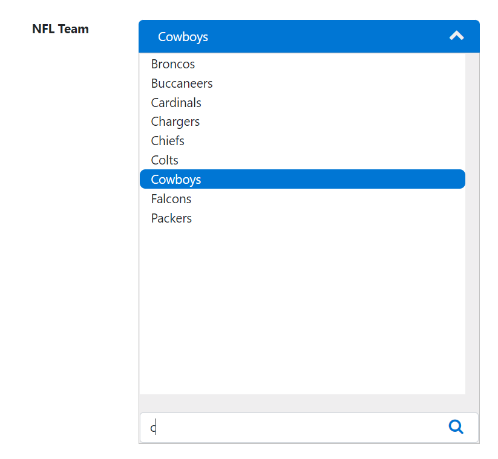
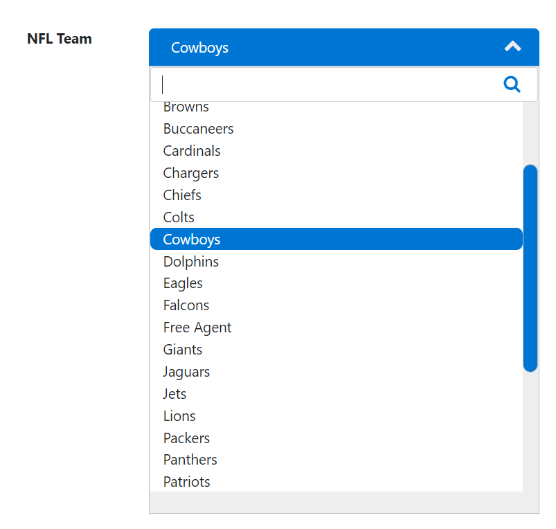

# jquery.dropdownsearchlist
   

        <h4>jQuery DropdownSearchList</h4>
        jQuery DropdownSearchList is a jquery plugin to allow you to support a larger list of items and have search capability to filter the list.
         
            
         
        <h4>Usage</h4>
        

            <pre>
            var items = [{ "id": "1", "name": "49ers" }, { "id": "2", "name": "Bears" }, { "id": "3", "name": "Bengals" }, 
                        { "id": "4", "name": "Bills" }, { "id": "5", "name": "Broncos" }, { "id": "6", "name": "Browns" }, 
                        { "id": "7", "name": "Buccaneers" }, { "id": "8", "name": "Cardinals" }, { "id": "9", "name": "Chargers" }, 
                        { "id": "10", "name": "Chiefs" }, { "id": "11", "name": "Colts" }, { "id": "12", "name": "Cowboys" }, 
                        { "id": "13", "name": "Dolphins" }, { "id": "14", "name": "Eagles" }, { "id": "15", "name": "Falcons" }, 
                        { "id": "33", "name": "Free Agent" }, { "id": "16", "name": "Giants" }, { "id": "17", "name": "Jaguars" }, 
                        { "id": "18", "name": "Jets" }, { "id": "19", "name": "Lions" }, { "id": "20", "name": "Packers" }, 
                        { "id": "21", "name": "Panthers" }, { "id": "22", "name": "Patriots" }, { "id": "23", "name": "Raiders" }, 
                        { "id": "24", "name": "Rams" }, { "id": "25", "name": "Ravens" }, { "id": "26", "name": "Redskins" }, 
                        { "id": "27", "name": "Saints" }, { "id": "28", "name": "Seahawks" }, { "id": "29", "name": "Steelers" }, 
                        { "id": "30", "name": "Texans" }, { "id": "31", "name": "Titans" }, { "id": "32", "name": "Vikings" }];
            
            $("#plugin-area").createddsearchlist({
            "payload": items,
            "defaultId": "3a87e465-aec0-df11-b8ec-00155da0f700",
            "fontSize": "11px",
            "searchPosition":"top", //Or bottom
            "label": "NFL Team",
            onChange: function (ev,data) {
            console.log(data);
            $("#selected-team").html(data.name);
            }});
            </pre>
        

    

